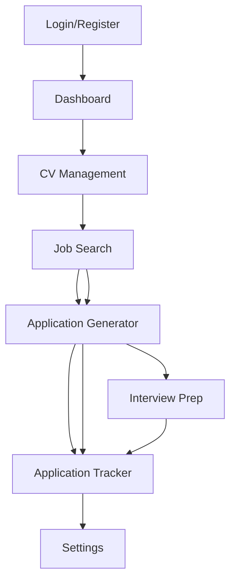

## 1. Product Overview
An intelligent web application that provides job seekers with an automated job search and application management system. Users can upload their CVs, search for jobs, generate optimized applications, and prepare for interviews through an intuitive web interface.

The application helps job seekers streamline their job search process by automating CV tailoring, cover letter generation, and interview preparation using AI-powered agents. Target market includes job seekers looking to optimize their application process and improve their chances of landing interviews.

## 2. Core Features

### 2.1 User Roles
| Role | Registration Method | Core Permissions |
|------|---------------------|------------------|
| Job Seeker | Email registration | Upload CVs, search jobs, generate applications, track progress |
| Premium User | Subscription upgrade | Unlimited applications, advanced templates, priority support |

### 2.2 Feature Module
The Job Market Agent web application consists of the following main pages:

1. **Dashboard**: Overview of job search progress, recent applications, and key metrics.
2. **CV Management**: Upload, view, and manage CV files with profile extraction.
3. **Job Search**: Search and browse job listings with intelligent filtering and ranking.
4. **Application Generator**: Create tailored CVs and cover letters for specific jobs.
5. **Interview Prep**: Access generated interview questions and preparation materials.
6. **Application Tracker**: View and manage all generated applications with status tracking.
7. **Settings**: Configure preferences, API keys, and account settings.

### 2.3 Page Details
| Page Name | Module Name | Feature description |
|-----------|-------------|---------------------|
| Dashboard | Stats Overview | Display total applications, success rate, active jobs, and recent activity timeline. |
| Dashboard | Quick Actions | Provide shortcuts to upload CV, search jobs, and generate new applications. |
| Dashboard | Job Recommendations | Show top 5 recommended jobs based on user profile and search history. |
| CV Management | CV Upload | Allow users to upload PDF or text CV files with drag-and-drop interface. |
| CV Management | Profile Viewer | Display extracted skills, experience, and career profile from uploaded CV. |
| CV Management | Profile Edit | Enable manual editing of extracted profile information and career goals. |
| Job Search | Search Interface | Provide search bar with job title, location, and advanced filters. |
| Job Search | Job Listings | Display job cards with company, title, location, salary, and match score. |
| Job Search | Job Details | Show full job description, requirements, and application generation button. |
| Application Generator | Template Selection | Offer choice of CV templates (modern, professional, academic) and customization options. |
| Application Generator | Preview Mode | Show side-by-side comparison of original and tailored CV content. |
| Application Generator | Cover Letter Editor | Provide rich text editor for customizing generated cover letters. |
| Application Generator | Export Options | Allow download of generated CV (PDF) and cover letter (TXT/DOCX). |
| Interview Prep | Question Generator | Create likely interview questions based on job description and user profile. |
| Interview Prep | Answer Suggestions | Provide suggested answers and talking points for generated questions. |
| Interview Prep | Company Research | Display company information and culture insights for interview preparation. |
| Application Tracker | Application List | Show table of all generated applications with status and dates. |
| Application Tracker | Application Details | View full application package including CV, cover letter, and job details. |
| Application Tracker | Status Management | Allow users to update application status (submitted, interview, rejected, etc.). |
| Settings | API Configuration | Input and manage Google API key for AI services. |
| Settings | Preferences | Configure default search parameters, template preferences, and notification settings. |
| Settings | Account Management | Update profile information, subscription status, and account settings. |

## 3. Core Process

### Job Seeker Flow
1. User uploads CV on CV Management page
2. System extracts profile and displays overview on Dashboard
3. User searches for jobs on Job Search page
4. User selects a job and generates application on Application Generator page
5. User accesses interview preparation materials on Interview Prep page
6. User tracks all applications on Application Tracker page

### Application Generation Flow
1. User selects a job from search results
2. System analyzes job requirements against user profile
3. User chooses CV template and customization options
4. System generates tailored CV content and cover letter
5. User reviews and edits generated content
6. User downloads final application package

## 4. User Interface Design

### 4.1 Design Style
- **Primary Colors**: Professional blue (#2563eb) for primary actions, green (#10b981) for success states
- **Secondary Colors**: Gray scale for backgrounds and text (#f3f4f6, #6b7280, #1f2937)
- **Button Style**: Rounded corners (8px radius), clear hover states, consistent sizing
- **Font**: Inter for headings and body text, monospace for code/API key display
- **Layout Style**: Card-based layout with consistent spacing, top navigation bar
- **Icons**: Heroicons for consistent iconography throughout the application

### 4.2 Page Design Overview
| Page Name | Module Name | UI Elements |
|-----------|-------------|-------------|
| Dashboard | Stats Overview | Clean card layout with large numbers, progress bars, and trend indicators using Chart.js. |
| Dashboard | Quick Actions | Prominent button cards with icons and clear CTAs in a responsive grid. |
| CV Management | CV Upload | Drag-and-drop zone with file preview and upload progress indicator. |
| Job Search | Job Listings | Responsive card grid with company logos, match scores as badges, and hover effects. |
| Application Generator | Preview Mode | Split-screen layout with original CV on left, tailored version on right. |
| Interview Prep | Question List | Accordion-style expandable sections for easy navigation and review. |
| Application Tracker | Application Table | Sortable data table with status badges, action buttons, and pagination. |

### 4.3 Responsiveness
Desktop-first design approach with mobile responsiveness. The application will adapt to tablet and mobile screens with collapsible navigation, stacked cards, and touch-friendly interactions. All interactive elements will be optimized for touch targets (minimum 44px).