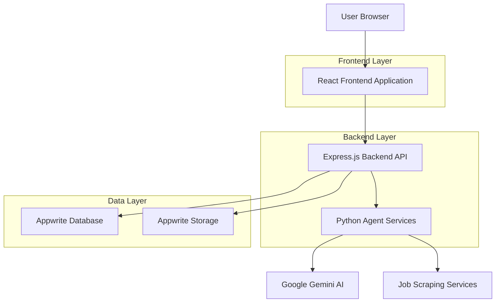
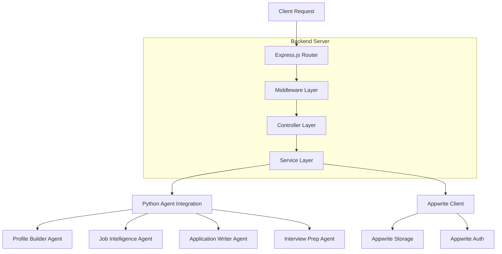
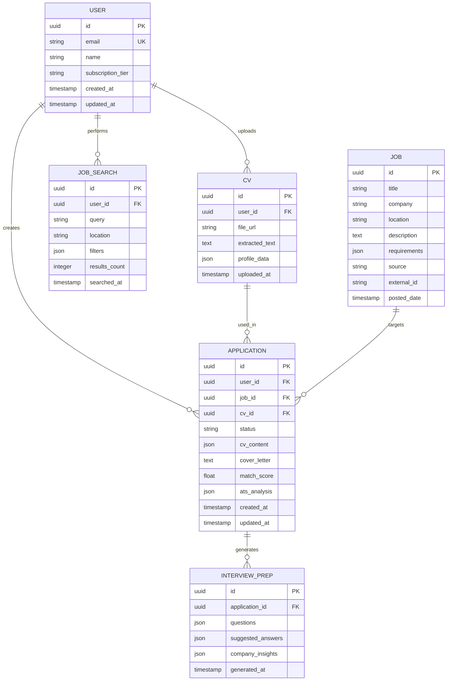

## 1. Architecture design



## 2. Technology Description

- **Frontend**: React@18 + tailwindcss@3 + vite + shadcn/ui
- **Backend**: Express.js@4 + Node.js
- **Database**: Appwrite (Document Collections)
- **File Storage**: Appwrite Storage
- **Authentication**: Appwrite Auth
- **AI Integration**: Python agent services with Google Gemini API
- **Styling**: Tailwind CSS with custom design system

## 3. Route definitions

| Route | Purpose |
|-------|---------|
| / | Dashboard - Main overview and statistics |
| /login | User authentication page |
| /register | User registration page |
| /cv-management | CV upload and profile management |
| /job-search | Job search and browsing interface |
| /applications | Application generator and editor |
| /interview-prep | Interview preparation materials |
| /tracker | Application tracking and management |
| /settings | User preferences and configuration |
| /api/auth/* | Authentication API endpoints |
| /api/jobs/* | Job search and management APIs |
| /api/cv/* | CV processing and profile APIs |
| /api/applications/* | Application generation APIs |
| /api/interview/* | Interview preparation APIs |

## 4. API definitions

### 4.1 Authentication APIs

**User Registration**
```
POST /api/auth/register
```

Request:
| Param Name | Param Type | isRequired | Description |
|------------|-------------|-------------|-------------|
| email | string | true | User email address |
| password | string | true | User password (min 8 characters) |
| name | string | true | User full name |

Response:
| Param Name | Param Type | Description |
|------------|-------------|-------------|
| user | object | User profile data |
| session | object | Authentication session token |

**User Login**
```
POST /api/auth/login
```

Request:
| Param Name | Param Type | isRequired | Description |
|------------|-------------|-------------|-------------|
| email | string | true | User email address |
| password | string | true | User password |

### 4.2 CV Management APIs

**Upload CV**
```
POST /api/cv/upload
```

Request:
| Param Name | Param Type | isRequired | Description |
|------------|-------------|-------------|-------------|
| file | file | true | PDF or text CV file |
| extract_profile | boolean | false | Whether to extract profile data |

Response:
| Param Name | Param Type | Description |
|------------|-------------|-------------|
| cv_id | string | Unique CV identifier |
| profile | object | Extracted candidate profile |
| upload_url | string | URL to access uploaded CV |

**Get Profile**
```
GET /api/cv/profile
```

Response:
| Param Name | Param Type | Description |
|------------|-------------|-------------|
| skills | array | List of extracted skills |
| experience | string | Experience level and background |
| education | string | Educational background |
| career_goals | string | Career aspirations |

### 4.3 Job Search APIs

**Search Jobs**
```
GET /api/jobs/search
```

Request:
| Param Name | Param Type | isRequired | Description |
|------------|-------------|-------------|-------------|
| query | string | true | Job search query |
| location | string | false | Job location |
| max_results | integer | false | Maximum results (default: 10) |
| sources | array | false | Job sources (linkedin, indeed) |

Response:
| Param Name | Param Type | Description |
|------------|-------------|-------------|
| jobs | array | Array of job objects with match scores |
| total_count | integer | Total number of jobs found |

**Get Job Details**
```
GET /api/jobs/:job_id
```

### 4.4 Application Generation APIs

**Generate Application**
```
POST /api/applications/generate
```

Request:
| Param Name | Param Type | isRequired | Description |
|------------|-------------|-------------|-------------|
| job_id | string | true | Target job identifier |
| cv_template | string | false | CV template choice (modern/professional/academic) |
| customization | object | false | Additional customization options |

Response:
| Param Name | Param Type | Description |
|------------|-------------|-------------|
| application_id | string | Unique application identifier |
| cv_content | string | Generated CV content |
| cover_letter | string | Generated cover letter |
| ats_score | number | ATS compatibility score |
| download_urls | object | URLs to download generated files |

### 4.5 Interview Preparation APIs

**Generate Interview Prep**
```
POST /api/interview/generate
```

Request:
| Param Name | Param Type | isRequired | Description |
|------------|-------------|-------------|
| job_id | string | true | Target job identifier |
| application_id | string | false | Related application ID |

Response:
| Param Name | Param Type | Description |
|------------|-------------|-------------|
| questions | array | Generated interview questions |
| suggested_answers | array | Suggested answers for questions |
| company_insights | object | Company culture and background info |

## 5. Server architecture diagram



## 6. Data model

### 6.1 Data model definition



### 6.2 Appwrite Collections

**Collections Overview**
```json
{
  "users": {
    "attributes": {
      "id": "string",
      "email": "string",
      "name": "string",
      "subscription_tier": {"type": "enum", "values": ["free", "premium"]},
      "created_at": "datetime",
      "updated_at": "datetime"
    },
    "indexes": ["email"],
    "permissions": "owner read/update"
  },
  "cvs": {
    "attributes": {
      "id": "string",
      "user_id": "string",
      "file_id": "string",
      "file_url": "string",
      "extracted_text": "string",
      "profile_data": "object",
      "uploaded_at": "datetime",
      "created_at": "datetime",
      "updated_at": "datetime"
    },
    "indexes": ["user_id", "uploaded_at"],
    "permissions": "owner read/create/update/delete"
  },
  "jobs": {
    "attributes": {
      "id": "string",
      "title": "string",
      "company": "string",
      "location": "string",
      "description": "string",
      "requirements": "object",
      "source": "string",
      "external_id": "string",
      "posted_date": "datetime",
      "created_at": "datetime",
      "updated_at": "datetime"
    },
    "indexes": ["title", "company", "location", "posted_date"],
    "permissions": "any read"
  },
  "applications": {
    "attributes": {
      "id": "string",
      "user_id": "string",
      "job_id": "string",
      "cv_id": "string",
      "status": {"type": "enum", "values": ["draft", "generated", "submitted", "interview", "rejected", "accepted"]},
      "cv_content": "object",
      "cover_letter": "string",
      "match_score": "float",
      "ats_analysis": "object",
      "created_at": "datetime",
      "updated_at": "datetime"
    },
    "indexes": ["user_id", "job_id", "status", "created_at"],
    "permissions": "owner read/update"
  },
  "interview_prep": {
    "attributes": {
      "id": "string",
      "application_id": "string",
      "questions": "array",
      "suggested_answers": "array",
      "company_insights": "object",
      "generated_at": "datetime"
    },
    "indexes": ["application_id"],
    "permissions": "owner read"
  },
  "job_search": {
    "attributes": {
      "id": "string",
      "user_id": "string",
      "query": "string",
      "location": "string",
      "filters": "object",
      "results_count": "integer",
      "searched_at": "datetime"
    },
    "indexes": ["user_id", "searched_at"],
    "permissions": "owner read"
  }
}
```

**Document Permissions Example**
```javascript
import { Permission, Role } from "node-appwrite"

const perms = [
  Permission.read(Role.user(userId)),
  Permission.update(Role.user(userId)),
  Permission.delete(Role.user(userId))
]
```

### 6.3 Appwrite Configuration

**Environment Variables**
```bash
APPWRITE_ENDPOINT=https://cloud.appwrite.io/v1
APPWRITE_PROJECT_ID=your_project_id
APPWRITE_API_KEY=your_api_key
APPWRITE_BUCKET_ID=job-files

GOOGLE_API_KEY=your_google_gemini_api_key

NODE_ENV=development
PORT=3000
```

**Appwrite Client Setup (Backend)**
```javascript
import { Client, Databases, Storage } from "node-appwrite"

const client = new Client()
  .setEndpoint(process.env.APPWRITE_ENDPOINT)
  .setProject(process.env.APPWRITE_PROJECT_ID)
  .setKey(process.env.APPWRITE_API_KEY)

export const databases = new Databases(client)
export const storage = new Storage(client)
```

**Appwrite Client Setup (Frontend)**
```javascript
import { Client, Account, Databases, Storage } from "appwrite"

const client = new Client()
  .setEndpoint(import.meta.env.VITE_APPWRITE_ENDPOINT)
  .setProject(import.meta.env.VITE_APPWRITE_PROJECT_ID)

export const account = new Account(client)
export const databases = new Databases(client)
export const storage = new Storage(client)
```
