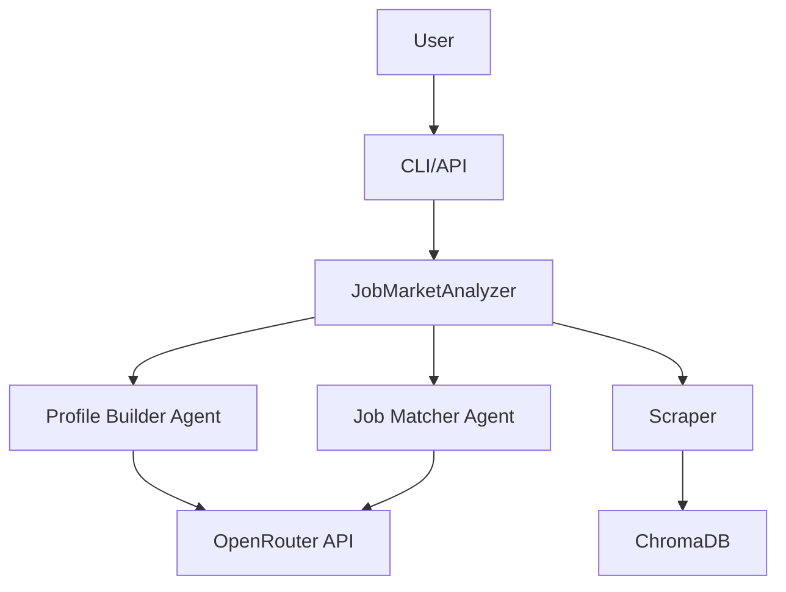

# Code Review & Improvement Suggestions

**Date:** 2025-01-27  
**Reviewer:** AI Code Review  
**Application:** Job Market AI Analyzer  
**Version:** 2.0.0

---

## 📊 Executive Summary

**Overall Assessment:** ⭐⭐⭐⭐ (4/5) - **Good**

The application is well-structured with solid functionality, good test coverage (83%), and thoughtful features. However, there are several areas where improvements would enhance maintainability, reliability, and scalability.

**Key Strengths:**
- ✅ Comprehensive feature set
- ✅ Good test coverage (83%)
- ✅ OpenRouter-only mode implementation
- ✅ Ethical guidelines and GDPR compliance
- ✅ Advanced caching system
- ✅ Multi-agent architecture

**Key Areas for Improvement:**
- ⚠️ Logging inconsistency (mix of print() and logging)
- ⚠️ Error handling could be more structured
- ⚠️ Configuration management could be centralized
- ⚠️ Some code duplication
- ⚠️ Missing type hints in some areas
- ⚠️ Large main.py file (2500+ lines)

---

## 🔍 Detailed Review

### 1. **Logging & Output Management** 🔴 High Priority

#### Issues Found:
- **Mixed logging approaches**: Mix of `print()` statements and `logging` module
- **No structured logging**: Missing log levels, timestamps, and context
- **Inconsistent error messages**: Some use emojis, some don't
- **No log rotation**: Logs could grow indefinitely

#### Current State:
```python
# utils/database.py
print(f"Error storing job {job.get('title', 'unknown')}: {e}")

# utils/knowledge_base.py
print(f"✅ Added document {document['id']} to {source}")
print(f"❌ Error adding document to {source}: {e}")

# main.py
logging.getLogger('agno').setLevel(logging.WARNING)  # Suppressed
```

#### Recommendations:

1. **Standardize on Python logging module:**
```python
# Create a centralized logger configuration
import logging
from logging.handlers import RotatingFileHandler

def setup_logging(log_level=logging.INFO):
    """Configure application-wide logging"""
    logger = logging.getLogger('job_market_analyzer')
    logger.setLevel(log_level)
    
    # Console handler with colored output
    console_handler = logging.StreamHandler()
    console_handler.setLevel(log_level)
    console_formatter = logging.Formatter(
        '%(asctime)s - %(name)s - %(levelname)s - %(message)s'
    )
    console_handler.setFormatter(console_formatter)
    
    # File handler with rotation
    file_handler = RotatingFileHandler(
        'app.log', maxBytes=10*1024*1024, backupCount=5
    )
    file_handler.setLevel(logging.DEBUG)
    file_formatter = logging.Formatter(
        '%(asctime)s - %(name)s - %(levelname)s - %(funcName)s:%(lineno)d - %(message)s'
    )
    file_handler.setFormatter(file_formatter)
    
    logger.addHandler(console_handler)
    logger.addHandler(file_handler)
    
    return logger
```

2. **Replace all print() statements:**
```python
# Instead of:
print(f"✅ Added document {document['id']} to {source}")

# Use:
logger.info(f"Added document {document['id']} to {source}")
logger.error(f"Error adding document to {source}: {e}", exc_info=True)
```

3. **Add structured logging for better observability:**
```python
import structlog

logger = structlog.get_logger()
logger.info("document_added", 
    document_id=document['id'],
    source=source,
    success=True
)
```

**Priority:** 🔴 High  
**Effort:** Medium  
**Impact:** High - Better debugging, monitoring, and production readiness

---

### 2. **Error Handling & Exception Management** 🟡 Medium Priority

#### Issues Found:
- **Bare except clauses**: `except:` without specific exceptions
- **Generic error messages**: Not enough context for debugging
- **Inconsistent error handling**: Some functions return None, others raise exceptions
- **No error recovery strategies**: Limited fallback mechanisms

#### Current State:
```python
# utils/database.py
try:
    jobs_collection = chroma_client.get_collection(name="job_postings")
except:  # ❌ Bare except
    jobs_collection = chroma_client.create_collection(...)

# utils/knowledge_base.py
except Exception as e:
    print(f"❌ Error adding document to {source}: {e}")  # Generic error
    return False
```

#### Recommendations:

1. **Create custom exception classes:**
```python
# exceptions.py
class JobMarketAnalyzerError(Exception):
    """Base exception for Job Market Analyzer"""
    pass

class CVProcessingError(JobMarketAnalyzerError):
    """Raised when CV processing fails"""
    pass

class JobScrapingError(JobMarketAnalyzerError):
    """Raised when job scraping fails"""
    pass

class APIError(JobMarketAnalyzerError):
    """Raised when API calls fail"""
    def __init__(self, message, status_code=None, retry_after=None):
        super().__init__(message)
        self.status_code = status_code
        self.retry_after = retry_after
```

2. **Use specific exception handling:**
```python
# Instead of:
try:
    jobs_collection = chroma_client.get_collection(name="job_postings")
except:  # ❌ Bad
    jobs_collection = chroma_client.create_collection(...)

# Use:
try:
    jobs_collection = chroma_client.get_collection(name="job_postings")
except chromadb.errors.NotFoundError:  # ✅ Specific
    logger.info("Collection not found, creating new collection")
    jobs_collection = chroma_client.create_collection(...)
except chromadb.errors.ChromaError as e:  # ✅ Specific
    logger.error(f"ChromaDB error: {e}", exc_info=True)
    raise DatabaseError(f"Failed to access ChromaDB: {e}") from e
```

3. **Implement retry decorator:**
```python
from tenacity import retry, stop_after_attempt, wait_exponential

@retry(
    stop=stop_after_attempt(3),
    wait=wait_exponential(multiplier=1, min=2, max=10),
    reraise=True
)
def store_jobs_in_db(jobs):
    """Store jobs with automatic retry on failure"""
    # Implementation
```

**Priority:** 🟡 Medium  
**Effort:** Medium  
**Impact:** Medium - Better error recovery and debugging

---

### 3. **Configuration Management** 🟡 Medium Priority

#### Issues Found:
- **Scattered configuration**: Environment variables read throughout codebase
- **No validation**: Configuration values not validated
- **No defaults documentation**: Hard to know what's configurable
- **Type inconsistencies**: Some configs are strings, some ints

#### Current State:
```python
# main.py - Configuration scattered
OPENROUTER_API_KEY = os.environ.get("OPENROUTER_API_KEY")
CACHE_MAX_SIZE_AGENT = int(os.getenv('CACHE_MAX_SIZE_AGENT', '500'))
DEFAULT_LOCATION = os.getenv('DEFAULT_LOCATION', 'San Francisco, CA')

# utils/scraping.py - More configuration
API_CONFIG = {
    'max_retries': int(os.getenv('API_MAX_RETRIES', '3')),
    'retry_delay_base': float(os.getenv('API_RETRY_DELAY', '2.0')),
}
```

#### Recommendations:

1. **Create centralized configuration class:**
```python
# config.py
from pydantic_settings import BaseSettings
from pydantic import Field, validator
from typing import List

class Settings(BaseSettings):
    """Application settings with validation"""
    
    # API Configuration
    openrouter_api_key: str = Field(..., env="OPENROUTER_API_KEY")
    openrouter_model_key: str = Field(default="deepseek-chat", env="OPENROUTER_MODEL_KEY")
    google_api_key: Optional[str] = Field(default=None, env="GOOGLE_API_KEY")
    openrouter_only: bool = Field(default=True, env="OPENROUTER_ONLY")
    
    # Cache Configuration
    cache_max_size_agent: int = Field(default=500, env="CACHE_MAX_SIZE_AGENT", ge=1, le=10000)
    cache_agent_ttl: int = Field(default=1800, env="CACHE_AGENT_TTL", ge=60)
    cache_job_ttl: int = Field(default=86400, env="CACHE_JOB_TTL", ge=3600)
    
    # Scraping Configuration
    max_jobs_per_site: int = Field(default=50, env="MAX_JOBS_PER_SITE", ge=1, le=500)
    scraping_timeout: int = Field(default=60, env="SCRAPING_TIMEOUT", ge=10, le=300)
    
    # API Configuration
    api_max_retries: int = Field(default=3, env="API_MAX_RETRIES", ge=1, le=10)
    api_retry_delay: float = Field(default=2.0, env="API_RETRY_DELAY", ge=0.1, le=60.0)
    api_timeout: int = Field(default=30, env="API_TIMEOUT", ge=5, le=300)
    
    # Application Configuration
    default_location: str = Field(default="San Francisco, CA", env="DEFAULT_LOCATION")
    cv_file_path: Optional[str] = Field(default=None, env="CV_FILE_PATH")
    log_level: str = Field(default="INFO", env="LOG_LEVEL")
    
    @validator('log_level')
    def validate_log_level(cls, v):
        valid_levels = ['DEBUG', 'INFO', 'WARNING', 'ERROR', 'CRITICAL']
        if v.upper() not in valid_levels:
            raise ValueError(f"Log level must be one of {valid_levels}")
        return v.upper()
    
    @validator('openrouter_only', pre=True)
    def parse_openrouter_only(cls, v):
        if isinstance(v, str):
            return v.lower() in ('true', '1', 'yes', 'on')
        return bool(v)
    
    class Config:
        env_file = '.env'
        env_file_encoding = 'utf-8'
        case_sensitive = False

# Singleton instance
settings = Settings()
```

2. **Use throughout application:**
```python
# Instead of:
OPENROUTER_API_KEY = os.environ.get("OPENROUTER_API_KEY")

# Use:
from config import settings
api_key = settings.openrouter_api_key
```

**Priority:** 🟡 Medium  
**Effort:** Medium  
**Impact:** Medium - Better maintainability and validation

---

### 4. **Code Organization & Architecture** 🟡 Medium Priority

#### Issues Found:
- **Large main.py file**: 2500+ lines - violates single responsibility
- **Mixed concerns**: CLI, business logic, and web server in one file
- **Code duplication**: Similar patterns repeated across modules
- **Tight coupling**: Direct imports and dependencies

#### Current State:
```python
# main.py - 2500+ lines containing:
# - CLI argument parsing
# - JobMarketAnalyzer class
# - CareerBoostPlatform class
# - Web server setup
# - Caching logic
# - Utility functions
```

#### Recommendations:

1. **Split main.py into modules:**
```
job_market_analyzer/
├── __init__.py
├── cli/
│   ├── __init__.py
│   ├── commands.py      # CLI commands
│   └── parser.py        # Argument parsing
├── core/
│   ├── __init__.py
│   ├── analyzer.py      # JobMarketAnalyzer
│   ├── platform.py      # CareerBoostPlatform
│   └── cache.py         # Caching logic
├── api/
│   ├── __init__.py
│   ├── server.py        # FastAPI app
│   └── routes.py        # API routes
├── config.py            # Configuration
└── main.py              # Entry point (thin)
```

2. **Extract common patterns:**
```python
# core/base.py
class BaseAgent:
    """Base class for all agents with common functionality"""
    def __init__(self, name: str, model, instructions: str):
        self.name = name
        self.model = model
        self.instructions = instructions
        self.logger = logging.getLogger(f"agent.{name}")
    
    def run_with_retry(self, prompt: str, max_retries: int = 3):
        """Run agent with automatic retry logic"""
        # Common retry logic
        pass
```

3. **Use dependency injection:**
```python
# Instead of global state:
knowledge_base = KnowledgeBase()

# Use dependency injection:
class JobMarketAnalyzer:
    def __init__(self, knowledge_base: KnowledgeBase, cache: AgentCache):
        self.knowledge_base = knowledge_base
        self.cache = cache
```

**Priority:** 🟡 Medium  
**Effort:** High  
**Impact:** High - Better maintainability and testability

---

### 5. **Type Hints & Type Safety** 🟢 Low Priority

#### Issues Found:
- **Missing type hints**: Many functions lack type annotations
- **Inconsistent typing**: Some use `Any`, some use specific types
- **No type checking**: No mypy or similar tooling

#### Current State:
```python
def store_jobs_in_db(jobs):  # ❌ No type hints
    """Store scraped jobs in ChromaDB"""
    for job in jobs:  # What is job?
        # ...
```

#### Recommendations:

1. **Add comprehensive type hints:**
```python
from typing import List, Dict, Optional, Union
from dataclasses import dataclass

@dataclass
class Job:
    """Job posting data structure"""
    title: str
    company: str
    location: str
    url: str
    description: str
    source: str
    id: Optional[str] = None
    posted_date: Optional[str] = None

def store_jobs_in_db(jobs: List[Dict[str, Any]]) -> int:
    """
    Store scraped jobs in ChromaDB
    
    Args:
        jobs: List of job dictionaries
        
    Returns:
        Number of jobs successfully stored
        
    Raises:
        DatabaseError: If storage fails
    """
    stored_count = 0
    for job in jobs:
        try:
            # Store job
            stored_count += 1
        except Exception as e:
            logger.error(f"Failed to store job: {e}")
    return stored_count
```

2. **Add mypy for type checking:**
```bash
# Add to requirements-dev.txt
mypy==1.5.1
types-requests==2.31.0.10

# Add to CI/CD
mypy job_market_analyzer --strict
```

**Priority:** 🟢 Low  
**Effort:** Medium  
**Impact:** Medium - Better IDE support and catch errors early

---

### 6. **Security Improvements** 🔴 High Priority

#### Issues Found:
- **API keys in code**: Placeholder keys in agent files
- **No input sanitization**: Some user inputs not validated
- **File path vulnerabilities**: Potential path traversal
- **No rate limiting**: API calls not rate-limited

#### Current State:
```python
# agents/profile_agent.py
OPENROUTER_API_KEY = os.environ.get("OPENROUTER_API_KEY", "sk-or-v1-test-key-PLACEHOLDER")
```

#### Recommendations:

1. **Remove placeholder API keys:**
```python
# Instead of:
OPENROUTER_API_KEY = os.environ.get("OPENROUTER_API_KEY", "sk-or-v1-test-key-PLACEHOLDER")

# Use:
OPENROUTER_API_KEY = os.environ.get("OPENROUTER_API_KEY")
if not OPENROUTER_API_KEY:
    raise ValueError("OPENROUTER_API_KEY environment variable is required")
```

2. **Add input validation:**
```python
from pathlib import Path
import re

def validate_file_path(file_path: str) -> Path:
    """Validate and sanitize file paths"""
    path = Path(file_path).resolve()
    
    # Prevent path traversal
    if not path.is_absolute():
        path = Path.cwd() / path
    
    # Ensure file exists and is readable
    if not path.exists():
        raise FileNotFoundError(f"File not found: {file_path}")
    
    if not path.is_file():
        raise ValueError(f"Path is not a file: {file_path}")
    
    # Check file extension
    allowed_extensions = {'.pdf', '.txt', '.doc', '.docx'}
    if path.suffix.lower() not in allowed_extensions:
        raise ValueError(f"Unsupported file type: {path.suffix}")
    
    return path
```

3. **Add rate limiting:**
```python
from functools import wraps
import time

class RateLimiter:
    def __init__(self, max_calls: int, period: float):
        self.max_calls = max_calls
        self.period = period
        self.calls = []
    
    def __call__(self, func):
        @wraps(func)
        def wrapper(*args, **kwargs):
            now = time.time()
            # Remove old calls
            self.calls = [c for c in self.calls if now - c < self.period]
            
            if len(self.calls) >= self.max_calls:
                sleep_time = self.period - (now - self.calls[0])
                if sleep_time > 0:
                    time.sleep(sleep_time)
            
            self.calls.append(time.time())
            return func(*args, **kwargs)
        return wrapper

# Usage
@RateLimiter(max_calls=10, period=60.0)
def call_openrouter_api(prompt: str):
    # API call
    pass
```

**Priority:** 🔴 High  
**Effort:** Medium  
**Impact:** High - Security and reliability

---

### 7. **Performance Optimizations** 🟢 Low Priority

#### Issues Found:
- **Synchronous scraping**: Jobs scraped sequentially
- **No connection pooling**: HTTP connections not reused
- **Large file processing**: CVs loaded entirely into memory
- **No async operations**: Could benefit from async/await

#### Recommendations:

1. **Add async job scraping:**
```python
import asyncio
from aiohttp import ClientSession

async def scrape_jobs_async(search_terms: List[str], location: str):
    """Scrape jobs from multiple sites concurrently"""
    async with ClientSession() as session:
        tasks = [
            scrape_site_async(session, term, location)
            for term in search_terms
        ]
        results = await asyncio.gather(*tasks, return_exceptions=True)
        return [r for r in results if not isinstance(r, Exception)]
```

2. **Add connection pooling:**
```python
import requests
from requests.adapters import HTTPAdapter
from urllib3.util.retry import Retry

def create_session():
    """Create HTTP session with connection pooling"""
    session = requests.Session()
    retry_strategy = Retry(
        total=3,
        backoff_factor=1,
        status_forcelist=[429, 500, 502, 503, 504]
    )
    adapter = HTTPAdapter(
        max_retries=retry_strategy,
        pool_connections=10,
        pool_maxsize=20
    )
    session.mount("http://", adapter)
    session.mount("https://", adapter)
    return session
```

3. **Stream large file processing:**
```python
def process_cv_streaming(cv_path: str):
    """Process CV in chunks to reduce memory usage"""
    with open(cv_path, 'rb') as f:
        chunk_size = 1024 * 1024  # 1MB chunks
        while chunk := f.read(chunk_size):
            # Process chunk
            yield process_chunk(chunk)
```

**Priority:** 🟢 Low  
**Effort:** High  
**Impact:** Medium - Better performance for large-scale usage

---

### 8. **Testing Improvements** 🟡 Medium Priority

#### Current State:
- ✅ Good test coverage (83%)
- ✅ Comprehensive test suite (150 tests)
- ⚠️ Some integration tests missing
- ⚠️ No performance tests
- ⚠️ No load tests

#### Recommendations:

1. **Add integration tests:**
```python
# tests/integration/test_full_workflow.py
@pytest.mark.integration
def test_complete_workflow_with_real_api():
    """Test complete workflow with mocked external APIs"""
    # Test end-to-end flow
    pass
```

2. **Add performance benchmarks:**
```python
# tests/performance/test_scraping_performance.py
import pytest
import time

@pytest.mark.performance
def test_scraping_performance(benchmark):
    """Benchmark job scraping performance"""
    result = benchmark(scrape_all_advanced, "engineer", "SF")
    assert len(result) > 0
    assert benchmark.stats.mean < 5.0  # Should complete in < 5 seconds
```

3. **Add property-based testing:**
```python
from hypothesis import given, strategies as st

@given(
    job_title=st.text(min_size=1, max_size=100),
    location=st.text(min_size=1, max_size=50)
)
def test_scrape_all_handles_any_input(job_title, location):
    """Test that scraping handles various inputs"""
    result = scrape_all(job_title, location)
    assert isinstance(result, list)
```

**Priority:** 🟡 Medium  
**Effort:** Medium  
**Impact:** Medium - Better reliability and confidence

---

### 9. **Documentation Improvements** 🟢 Low Priority

#### Issues Found:
- **Missing docstrings**: Some functions lack documentation
- **No API documentation**: No OpenAPI/Swagger docs
- **No architecture diagrams**: Hard to understand system design
- **Incomplete README**: Some features not documented

#### Recommendations:

1. **Add comprehensive docstrings:**
```python
def store_jobs_in_db(jobs: List[Dict[str, Any]]) -> int:
    """
    Store scraped jobs in ChromaDB vector database.
    
    This function processes a list of job dictionaries, extracts skills,
    generates embeddings (if not in OpenRouter-only mode), and stores
    them in ChromaDB for semantic search.
    
    Args:
        jobs: List of job dictionaries. Each dictionary must contain:
            - title (str): Job title
            - company (str): Company name
            - location (str): Job location
            - url (str): Job posting URL
            - description (str): Job description
            - source (str): Source website
            - id (str, optional): Unique job ID
            - posted_date (str, optional): ISO format date
    
    Returns:
        int: Number of jobs successfully stored
    
    Raises:
        DatabaseError: If ChromaDB operations fail
        ValueError: If job data is invalid
    
    Example:
        >>> jobs = [
        ...     {
        ...         'title': 'Software Engineer',
        ...         'company': 'TechCorp',
        ...         'location': 'SF',
        ...         'url': 'https://example.com/job1',
        ...         'description': 'Python developer needed',
        ...         'source': 'indeed'
        ...     }
        ... ]
        >>> stored = store_jobs_in_db(jobs)
        >>> assert stored == 1
    """
    # Implementation
```

2. **Generate API documentation:**
```python
# Add to FastAPI app
from fastapi.openapi.utils import get_openapi

def custom_openapi():
    if app.openapi_schema:
        return app.openapi_schema
    openapi_schema = get_openapi(
        title="Job Market AI Analyzer API",
        version="2.0.0",
        description="API for job market analysis and career assistance",
        routes=app.routes,
    )
    app.openapi_schema = openapi_schema
    return app.openapi_schema

app.openapi = custom_openapi
```

3. **Add architecture diagrams:**
```markdown
# ARCHITECTURE.md
## System Architecture


```

**Priority:** 🟢 Low  
**Effort:** Low  
**Impact:** Medium - Better developer experience

---

### 10. **Dependency Management** 🟢 Low Priority

#### Issues Found:
- **Pinned versions**: Good for security, but need regular updates
- **No security scanning**: No automated vulnerability checks
- **Large dependency tree**: Many transitive dependencies

#### Recommendations:

1. **Add dependency scanning:**
```yaml
# .github/workflows/security.yml
name: Security Scan
on: [push, pull_request]
jobs:
  scan:
    runs-on: ubuntu-latest
    steps:
      - uses: actions/checkout@v3
      - name: Run Safety Check
        run: |
          pip install safety
          safety check --json
```

2. **Add requirements-dev.txt:**
```txt
# Development dependencies
-r requirements.txt
pytest==7.4.0
pytest-cov==4.1.0
black==23.7.0
flake8==6.0.0
mypy==1.5.1
safety==2.3.5
```

3. **Use dependency groups:**
```toml
# pyproject.toml
[project]
dependencies = [
    "agno==2.2.1",
    # ... core deps
]

[project.optional-dependencies]
dev = [
    "pytest==7.4.0",
    "black==23.7.0",
]
```

**Priority:** 🟢 Low  
**Effort:** Low  
**Impact:** Low - Better security posture

---

## 📋 Priority Matrix

| Priority | Issue | Effort | Impact | Recommendation |
|----------|-------|--------|--------|----------------|
| 🔴 High | Logging inconsistency | Medium | High | Standardize on logging module |
| 🔴 High | Security (API keys, input validation) | Medium | High | Remove placeholders, add validation |
| 🟡 Medium | Error handling | Medium | Medium | Custom exceptions, specific handling |
| 🟡 Medium | Configuration management | Medium | Medium | Centralized config class |
| 🟡 Medium | Code organization | High | High | Split main.py, extract patterns |
| 🟡 Medium | Testing improvements | Medium | Medium | Add integration/performance tests |
| 🟢 Low | Type hints | Medium | Medium | Add comprehensive type hints |
| 🟢 Low | Performance optimizations | High | Medium | Add async, connection pooling |
| 🟢 Low | Documentation | Low | Medium | Add docstrings, API docs |
| 🟢 Low | Dependency management | Low | Low | Add security scanning |

---

## 🎯 Recommended Implementation Order

### Phase 1: Critical Improvements (Weeks 1-2)
1. ✅ Standardize logging (replace all print() statements)
2. ✅ Remove placeholder API keys
3. ✅ Add input validation and sanitization
4. ✅ Improve error handling with custom exceptions

### Phase 2: Architecture Improvements (Weeks 3-4)
5. ✅ Centralize configuration management
6. ✅ Split main.py into modules
7. ✅ Extract common patterns

### Phase 3: Quality Improvements (Weeks 5-6)
8. ✅ Add comprehensive type hints
9. ✅ Improve documentation
10. ✅ Add integration tests

### Phase 4: Performance & Polish (Weeks 7-8)
11. ✅ Add async operations where beneficial
12. ✅ Add performance benchmarks
13. ✅ Security scanning and dependency updates

---

## 📊 Metrics & Success Criteria

### Code Quality Metrics
- **Current:** 83% test coverage
- **Target:** 90%+ test coverage
- **Current:** Mixed logging
- **Target:** 100% structured logging
- **Current:** ~2500 line main.py
- **Target:** <500 lines per file

### Performance Metrics
- **Current:** Synchronous scraping
- **Target:** 50% faster with async
- **Current:** No rate limiting
- **Target:** Respect API rate limits
- **Current:** No connection pooling
- **Target:** Reuse connections

### Security Metrics
- **Current:** Placeholder keys in code
- **Target:** Zero hardcoded secrets
- **Current:** Basic input validation
- **Target:** Comprehensive validation
- **Current:** No security scanning
- **Target:** Automated vulnerability checks

---

## 🛠️ Quick Wins (Can be done immediately)

1. **Replace print() with logging** (2-3 hours)
   - Find all print() statements
   - Replace with appropriate log levels
   - Test and verify

2. **Remove placeholder API keys** (30 minutes)
   - Search for "PLACEHOLDER" in codebase
   - Replace with proper error handling
   - Update tests

3. **Add type hints to public APIs** (4-6 hours)
   - Start with main.py functions
   - Add to agent classes
   - Use mypy to validate

4. **Create configuration class** (2-3 hours)
   - Create config.py with Pydantic
   - Migrate environment variable reads
   - Update imports

5. **Add API documentation** (1-2 hours)
   - Add OpenAPI schema to FastAPI
   - Document endpoints
   - Generate Swagger UI

---

## 📚 Additional Resources

### Recommended Reading
- [Python Logging Best Practices](https://docs.python.org/3/howto/logging.html)
- [Pydantic Settings](https://docs.pydantic.dev/latest/usage/settings/)
- [FastAPI Documentation](https://fastapi.tiangolo.com/)
- [Python Type Hints](https://docs.python.org/3/library/typing.html)

### Tools to Consider
- **Logging:** `structlog` for structured logging
- **Configuration:** `pydantic-settings` for validated config
- **Type Checking:** `mypy` for static type analysis
- **Code Quality:** `ruff` (faster alternative to flake8)
- **Security:** `safety` for dependency scanning
- **Testing:** `pytest-asyncio` for async tests

---

## ✅ Conclusion

The Job Market AI Analyzer is a well-built application with solid foundations. The suggested improvements will enhance:

- **Maintainability:** Better code organization and documentation
- **Reliability:** Improved error handling and logging
- **Security:** Better input validation and secret management
- **Performance:** Async operations and optimizations
- **Developer Experience:** Type hints, better docs, clearer structure

**Estimated Total Effort:** 6-8 weeks for full implementation  
**Recommended Approach:** Incremental improvements, prioritize high-impact items first

---

**Review Completed:** 2025-01-27  
**Next Review:** After Phase 1 implementation

